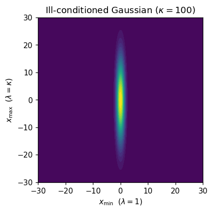
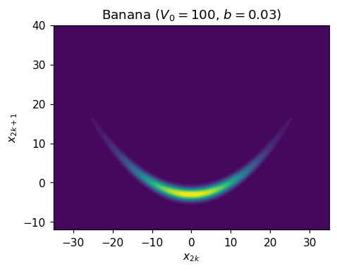
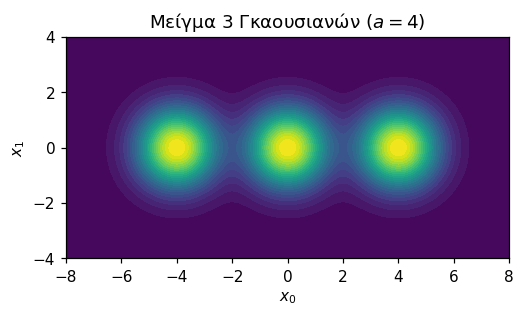
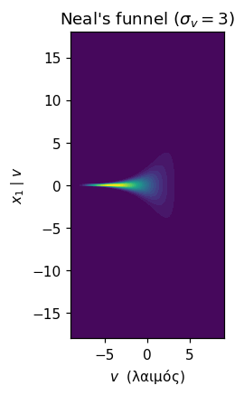
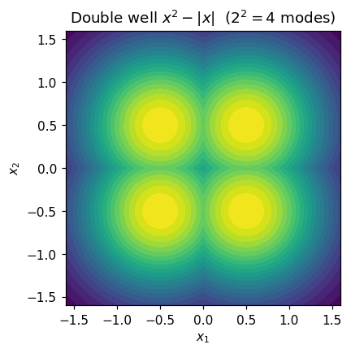

# Προτεινόμενες επιπρόσθετες κατανομές-στόχοι

## Πλαίσιο

Η μελέτη συγκρίνει τους ULA, MALA και underdamped BAOAB σε τρεις στόχους που μεταβάλλουν
αποκλειστικά τη **βαρύτητα ουράς** (Γκαουσιανή, Student-$t_5$, Cauchy). Καθώς και οι τρεις
είναι ισοτροπικοί, μονοκόρυφοι και (σχεδόν) log-concave, καλύπτεται ένας μόνο άξονας
δυσκολίας. Προτείνεται η επέκταση με πέντε στόχους που καλύπτουν τους υπόλοιπους
**καθιερωμένους άξονες** της βιβλιογραφίας gradient-based MCMC (conditioning, μη-γραμμική
συσχέτιση, πολυτροπικότητα, state-dependent scale, μη-λειότητα), σε αντιστοιχία με τις
τυπικές benchmark συλλογές (Inference Gym, posteriordb, MCBench).

Όλοι οι στόχοι έχουν τη μορφή $\pi(x)\propto e^{-U(x)}$ στο $\mathbb{R}^d$ και διαθέτουν
γνωστή αναφορά (αναλυτικές περιθώριες ή ακριβή i.i.d. δειγματοληψία), ώστε να παραμένουν
συμβατοί με τα υπάρχοντα διαγνωστικά (KS, q-MAE, tail-coverage).

| # | Κατανομή | Άξονας δυσκολίας | Τι δυσκολεύει τον sampler | Τι περιμένουμε στην απόδοση (ULA / MALA / BAOAB) |
|---|----------|------------------|----------------------------|--------------------------------------------------|
| 1 | Ανισοτροπική (ill-conditioned) Γκαουσιανή | conditioning | Στενή σε μία κατεύθυνση, φαρδιά σε άλλη: το βήμα που χωράει στη στενή είναι πολύ μικρό για να διασχίσει τη φαρδιά. | Όλοι χειροτερεύουν καθώς αυξάνεται το $\kappa$. **ULA**: βήμα δεσμευμένο από τη στενή κατεύθυνση → bias + αργή ανάμειξη ($\sim\kappa$). **MALA**: αποδοχή πέφτει, αναγκάζει μικρά βήματα. **BAOAB**: η ορμή βοηθά να διασχίζεται γρήγορα η φαρδιά κατεύθυνση → καλύτερη κλιμάκωση ($\sim\sqrt{\kappa}$), αναμενόμενα ο νικητής. |
| 2 | Rosenbrock / banana | μη-γραμμική συσχέτιση | Η ίδια στενή κοιλάδα αλλά **λυγισμένη**: η σωστή κατεύθυνση κίνησης αλλάζει κατά μήκος της ράχης. | Όλοι παλεύουν στη ράχη με σταθερό $\eta$. **ULA**: bias στις περιοχές υψηλής καμπυλότητας. **MALA**: χαμηλή αποδοχή στο λύγισμα. **BAOAB**: ακολουθεί καλύτερα τη ράχη αλλά η ορμή μπορεί να «ξεφεύγει» στις στροφές. Διαφορές ορατές στο variance bias της λυγισμένης συντεταγμένης. |
| 3 | Μείγμα τριών Γκαουσιανών | πολυτροπικότητα / metastability | Πολλά χωριστά modes με κενά ανάμεσά τους· ο sampler κολλάει σε ένα και δύσκολα περνά στα άλλα. | Κανένας δεν είναι φτιαγμένος για mode-jumping, οπότε περιμένουμε **όλοι να αποτυγχάνουν να αναμειχθούν** για $a=4$: το mode-occupancy θα δείξει εγκλωβισμό. **MALA** ιδίως απορρίπτει σχεδόν όλες τις διασχίσεις· **BAOAB** ίσως λίγο καλύτερο λόγω ορμής, αλλά πιθανότατα ανεπαρκές. Το βασικό «μάθημα» αυτού του στόχου. |
| 4 | Funnel του Neal | state-dependent scale | Η σωστή κλίμακα βήματος **αλλάζει ανάλογα με τη θέση** (μικροσκοπικά βήματα στον λαιμό, μεγάλα στο φαρδύ μέρος). | Κανένα σταθερό $\eta$ δεν δουλεύει: στον στενό λαιμό **ULA** γίνεται ασταθές, **MALA** καταρρέει σε αποδοχή. Περιμένουμε το γνωστό pathology — **υποεκτίμηση της διασποράς του $v$** και ελλιπή κάλυψη του λαιμού από όλους. Διαφορές κυρίως στο πόσο βαθιά μπαίνει ο καθένας στον λαιμό. |
| 5 | Double well $x^2-\lvert x\rvert$ | metastability $\propto 2^d$ + μη-λειότητα | $2^d$ modes (η metastability εκρήγνυται με τη διάσταση) **και** γωνία στην κλίση, που παραβιάζει την υπόθεση λειότητας της θεωρίας Langevin. | Το φράγμα ανά συντεταγμένη είναι ρηχό ($\tfrac14$), οπότε η διάσχιση των wells είναι σχετικά εύκολη· το ενδιαφέρον είναι η **μη-λειότητα**. **ULA**: μεγαλύτερο bias κοντά στη γωνία στο 0. **MALA**: παραμένει ακριβές (η MH διόρθωση καλύπτει). **BAOAB**: ενδιάμεσο, αλλά εγγενώς συμβατό με το πλαίσιο Leimkuhler–Matthews. Διαφορές στο q-MAE γύρω από το 0. |

---

## 1. Ανισοτροπική (ill-conditioned) Γκαουσιανή

$$\pi=\mathcal{N}(0,\Sigma),\quad \Sigma=\mathrm{diag}(\lambda_1,\dots,\lambda_d),\quad
U(x)=\tfrac12\sum_i \frac{x_i^2}{\lambda_i}$$

Πρόκειται για ανεξάρτητες Γκαουσιανές ανά συντεταγμένη, αλλά με πολύ διαφορετικές κλίμακες:
οι διασπορές (ιδιοτιμές της $\Sigma$) είναι **log-spaced** στο $[1,\kappa]$, δηλαδή
$\lambda_i=\kappa^{(i-1)/(d-1)}$, ώστε $\lambda_{\min}=1$ και $\lambda_{\max}=\kappa$. Ο
λόγος τους είναι ο **condition number** $\kappa=\lambda_{\max}/\lambda_{\min}$, που παίζει
τον ρόλο της ρυθμιζόμενης παραμέτρου δυσκολίας ($\kappa\in\{10,100,1000\}$).

Ο στόχος απομονώνει την εξάρτηση της απόδοσης από το conditioning: το μέγιστο επιτρεπτό βήμα
$\eta$ περιορίζεται από τη **στενότερη** κατεύθυνση ($\lambda_{\min}$, όπου μεγάλο $\eta$
οδηγεί σε αστάθεια), ενώ ο χρόνος ανάμειξης κυριαρχείται από την **πλατύτερη** κατεύθυνση
($\lambda_{\max}$, που χρειάζεται πολλά μικρά βήματα για να διασχιστεί). Όσο μεγαλώνει το
$\kappa$, τόσο ανοίγει αυτή η ψαλίδα. Οι περιθώριες είναι αναλυτικές,
$x_i\sim\mathcal{N}(0,\lambda_i)$.

## 2. Rosenbrock / banana (twisted Gaussian)

Ο στόχος προκύπτει από μια Γκαουσιανή την οποία «λυγίζουμε» σε σχήμα μπανάνας (Haario κ.ά.),
και ορίζεται ως **γινόμενο ανεξάρτητων 2D μπλοκ**, ώστε η διάσταση να κλιμακώνεται χωρίς να
αλλάζει η δυσκολία ανά μπλοκ. Για κάθε ζεύγος συντεταγμένων $(x_{2k},x_{2k+1})$ ορίζουμε τη
βοηθητική μεταβλητή

$$u \;=\; x_{2k+1}-b\,x_{2k}^2+b\,V_0,$$

και το δυναμικό είναι

$$U(x)=\tfrac12\sum_{k}\Big[\frac{x_{2k}^2}{V_0}+u^2\Big],\qquad V_0=100,\ b=0.03.$$

**Διαίσθηση.** Η $u$ είναι η «ίσια» (μη-λυγισμένη) Γκαουσιανή μεταβλητή: αν ξεκινήσουμε από
$y_{2k}\sim\mathcal{N}(0,V_0)$ και $y_{2k+1}\sim\mathcal{N}(0,1)$ ανεξάρτητες και θέσουμε

$$x_{2k}=y_{2k},\qquad x_{2k+1}=y_{2k+1}+b\,(y_{2k}^2-V_0),$$

τότε ακριβώς $u=y_{2k+1}\sim\mathcal{N}(0,1)$. Δηλαδή το $b\,x_{2k}^2$ είναι το «λύγισμα» που
δημιουργεί την καμπύλη ράχη, ενώ ο όρος $+b\,V_0$ κεντράρει τη λυγισμένη συντεταγμένη ώστε
$\mathbb{E}[x_{2k+1}]=0$. Αυτή η κατασκευή δίνει και τον τρόπο για **ακριβή i.i.d.
δειγματοληψία** (δειγματίζουμε τις $y$ και εφαρμόζουμε τον μετασχηματισμό).

Ο στόχος δοκιμάζει τη μη-γραμμική (καμπύλη) συσχέτιση: κατά μήκος της ράχης αλλάζουν συνεχώς
ο τοπικά βέλτιστος προσανατολισμός και η κλίμακα του βήματος, οπότε κανένα σταθερό $\eta$ δεν
ταιριάζει παντού. Οι δεύτερες ροπές είναι αναλυτικές: $\mathrm{Var}[x_{2k}]=V_0$ και
$\mathrm{Var}[x_{2k+1}]=1+2b^2V_0^2$ (από $\mathrm{Var}[y_{2k}^2]=2V_0^2$).

**Επιλογή παραμέτρων.** Οι τιμές $V_0=100$ και $b=0.03$ είναι οι καθιερωμένες της twisted
Gaussian (Haario, Saksman & Tamminen 1999). Το $V_0$ ελέγχει πόσο **επιμήκης** είναι η
κοιλάδα: $\mathrm{Var}[x_{2k}]=100$ (τυπική απόκλιση $10$) έναντι
$\mathrm{Var}[x_{2k+1}]\approx19$ (τυπική απόκλιση $\approx4.4$), ώστε η μία κατεύθυνση να
είναι αρκετά φαρδύτερη από την άλλη και να προκύπτει η χαρακτηριστική μορφή μπανάνας. Το $b$
ελέγχει πόσο έντονα **λυγίζει** η ράχη (μέσω του όρου $b\,x_{2k}^2$): στα τυπικά εύρη της
$x_{2k}$ το λύγισμα είναι μεγέθους συγκρίσιμου με το πλάτος της $x_{2k+1}$, δηλαδή ορατό αλλά
όχι ακραίο. Η τιμή $b=0.03$ αντιστοιχεί στο «ήπιο» λύγισμα της αρχικής εργασίας (έναντι του
«έντονου» $b=0.1$), ώστε ο στόχος να απομονώνει καθαρά τη μη-γραμμική συσχέτιση.

**Γιατί ανεξάρτητα 2D μπλοκ και όχι ενιαία banana.** Η εναλλακτική (η κλασική *chained
Rosenbrock*, όπου κάθε συντεταγμένη λυγίζει την επόμενη σε μία μακριά αλυσίδα) έχει δύο
μειονεκτήματα για τον σκοπό μας. Πρώτον, η αλυσίδα εισάγει μακρά εξάρτηση μεταξύ όλων των
συντεταγμένων, οπότε ανακατεύει τη μη-γραμμική συσχέτιση με conditioning (#1) και δεν
απομονώνει πια έναν μόνο άξονα δυσκολίας. Δεύτερον, δεν διαθέτει καθαρές κλειστές μορφές, ώστε
χάνονται η ακριβής i.i.d. αναφορά και οι αναλυτικές ροπές που χρειάζονται τα διαγνωστικά (KS,
q-MAE, tail-coverage). Με το γινόμενο $d/2$ πανομοιότυπων 2D μπλοκ, αντιθέτως, η δυσκολία ανά
μπλοκ μένει σταθερή καθώς αυξάνεται το $d$ (οπότε η επίδραση της διάστασης απομονώνεται), η
καμπύλη συσχέτιση παραμένει ο μοναδικός άξονας, και διατηρείται η ακριβής αναφορά.

## 3. Μείγμα τριών Γκαουσιανών

Ο στόχος είναι άθροισμα τριών **ισοβαρών** (βάρος $1/3$ ο καθένας) components μοναδιαίας
συνδιακύμανσης. Τα κέντρα διαφέρουν μόνο στην **πρώτη συντεταγμένη** $x_0$, παίρνοντας τις
τιμές $c\in\{-a,0,a\}$ (με $a=4$), ενώ σε όλες τις υπόλοιπες συντεταγμένες το κέντρο είναι 0·
δηλαδή $\mu_k=(c_k,0,\dots,0)$. Το δυναμικό είναι

$$U(x)=-\log\sum_{k=1}^{3} \exp\!\big(-\tfrac12\lVert x-\mu_k\rVert^2\big).$$

Δοκιμάζει την πολυτροπικότητα και τη metastability, καθώς η ανάμειξη απαιτεί τη διάσχιση
περιοχών χαμηλής πυκνότητας ανάμεσα στα modes (απόσταση $a=4$ τυπικών αποκλίσεων). Επειδή τα
κέντρα μετακινούνται μόνο κατά μήκος της $x_0$, ο **αριθμός των modes παραμένει 3 ανεξάρτητα
από το $d$**. Η περιθώρια της $x_0$ είναι το μονοδιάστατο μείγμα
$\tfrac13\sum_k\mathcal{N}(c_k,1)$ (αναλυτική CDF, με αντιστροφή μέσω bisection), ενώ κάθε
άλλη συντεταγμένη είναι $\mathcal{N}(0,1)$. Ο στόχος συνοδεύεται από διαγνωστικό
mode-occupancy (ποσοστό δειγμάτων ανά mode).

## 4. Neal's Funnel

Μια ιεραρχική «συντεταγμένη-λαιμός» $v$ ελέγχει τη διασπορά όλων των υπολοίπων:

$$v\equiv x_0\sim\mathcal{N}(0,\sigma_v^2),\quad x_i\mid v\sim\mathcal{N}(0,e^{v})\ (i\ge1),
\quad \sigma_v=3$$
$$U(x)=\underbrace{\frac{v^2}{2\sigma_v^2}}_{-\log p(v)}+\underbrace{\frac{d-1}{2}\,v
+\tfrac12 e^{-v}\sum_{i\ge1}x_i^2}_{-\log p(x_{1:}\mid v)}$$

Ο γραμμικός ως προς $v$ όρος $\tfrac{d-1}{2}v$ **δεν είναι αυθαίρετος**: προέρχεται από τη
σταθερά κανονικοποίησης των $(d-1)$ υπό-συνθήκη Γκαουσιανών, αφού η τυπική απόκλισή τους είναι
$e^{v/2}$ και άρα $-\log p(x_i\mid v)=\tfrac12 v+\tfrac12 e^{-v}x_i^2+\text{const}$.

Είναι το πρότυπο benchmark γεωμετρίας ιεραρχικών μοντέλων στη βιβλιογραφία HMC/NUTS (προκύπτει,
λ.χ., από κεντραρισμένη παραμετροποίηση). Ο τοπικός condition number μεταβάλλεται κατά τάξεις
μεγέθους με τη θέση (**state-dependent scale**): για μικρό $v$ ο λαιμός είναι πολύ στενός και
για μεγάλο $v$ πολύ φαρδύς, οπότε δεν υπάρχει καθολικά βέλτιστο $\eta$. Ο στόχος επιτρέπει
ακριβή δειγματοληψία (πρώτα $v$, μετά $x_i\mid v$): η περιθώρια του λαιμού είναι αναλυτική,
$v\sim\mathcal{N}(0,9)$, ενώ οι υπό-συνθήκη συντεταγμένες είναι scale mixtures με αναλυτική
δεύτερη ροπή $\mathrm{Var}[x_i]=\mathbb{E}[e^{v}]=e^{\sigma_v^2/2}\approx 90$.

## 5. Double well $x^2-\lvert x\rvert$

$$U(x)=\sum_i\big(x_i^2-\lvert x_i\rvert\big)$$

Το δυναμικό είναι **διαχωρίσιμο** (άθροισμα ίδιων όρων ανά συντεταγμένη). Σε κάθε συντεταγμένη,
ο όρος $x_i^2-\lvert x_i\rvert$ ελαχιστοποιείται στο $x_i=\pm\tfrac12$ (για $x_i>0$:
$x_i^2-x_i$ με ελάχιστο στο $x_i=\tfrac12$, βάθος $-\tfrac14$), άρα υπάρχουν **δύο wells στο
$\pm\tfrac12$ ανά συντεταγμένη** και συνολικά $2^d$ modes. Ο στόχος δοκιμάζει την κλιμάκωση της metastability
με τη διάσταση.

Επιπλέον, ο όρος $\lvert x\rvert$ καθιστά το δυναμικό **μη-λείο**: η κλίση είναι ασυνεχής στο
0 (υπο-διαφορικό), παραβιάζοντας την υπόθεση Lipschitz-συνεχούς κλίσης στην οποία στηρίζεται η
θεωρία Langevin — έναν άξονα δυσκολίας που δεν καλύπτεται από κανέναν άλλο στόχο. Το double
well (bistable potential) είναι καθιερωμένο benchmark metastability στη στατιστική φυσική και
στη molecular dynamics, πεδίο στο οποίο αναπτύχθηκε και ο BAOAB integrator (Leimkuhler–Matthews).
Λόγω της product form, η περιθώρια είναι κοινή και μονοδιάστατη για όλες τις συντεταγμένες
(αριθμητική CDF/quantile).

---

## Σημείωση για την κλιμάκωση διάστασης

- Στη banana το $d$ είναι άρτιο, καθώς ο στόχος είναι γινόμενο $d/2$ ανεξάρτητων 2D μπλοκ.
- Στο funnel η δομή είναι «μία ιεραρχική συντεταγμένη $v$ συν $(d-1)$ υπό-συνθήκη συντεταγμένες».
- Στο μείγμα τα modes τοποθετούνται μόνο στην πρώτη συντεταγμένη, οπότε η πολυτροπικότητα
  (3 modes) παραμένει σταθερή ως προς $d$.
- Στο double well ο στόχος είναι διαχωρίσιμος με $2^d$ modes, οπότε η πολυτροπικότητα
  κλιμακώνεται εκθετικά με τη διάσταση.

## Διαγνωστικά και αναφορά

Τα KS, q-MAE και tail-coverage χρησιμοποιούν αναλυτικές περιθώριες όπου αυτές υπάρχουν. Για
τις συντεταγμένες χωρίς κλειστή περιθώρια (τη λυγισμένη της banana και τις υπό-συνθήκη του
funnel) η σύγκριση στηρίζεται στις αναλυτικές ροπές (mean/variance bias) και, προαιρετικά, σε
ακριβή reference samples. Για τους πολυτροπικούς στόχους προστίθεται μετρική mode-occupancy.